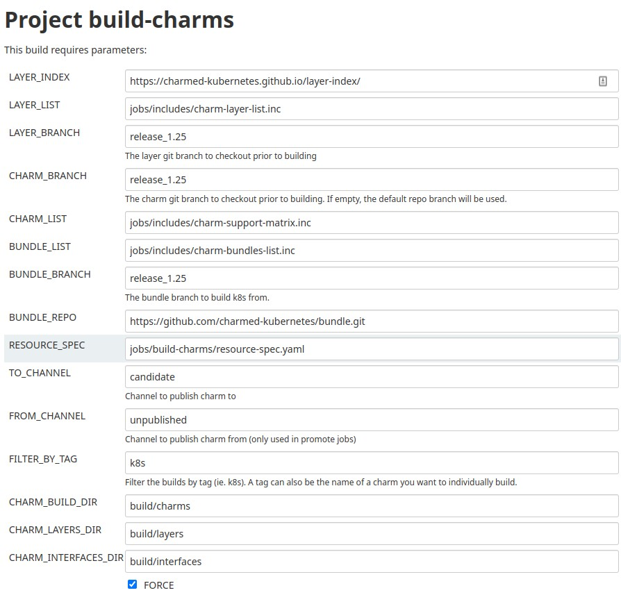

# Creating a bugfix release
Performs a Kubernetes bugfix release, which includes validation across the base
deployment as well as variations including calico, tigera, vault, nvidia, and
ceph.

## Bugfix Release Process

### Cherry-pick fixes from master into stable branches

### Document release notes

- Bugfixes
- Enhancements
- Known Limitations/Issues

### Tag existing stable branches with bugfix release tag

**Job**: https://jenkins.canonical.com/k8s/job/sync-stable-tag-bugfix-rev/

This will tag all stable repos with the k8s version and bugfix revision
associated, for example, the first bugfix release of 1.16 would be
**1.16+ck1**

#### Charm tag options

### Run the **build-charms** job

**Job**: https://jenkins.canonical.com/k8s/job/build-charms/

This will build and promote the stable charms to candidate channel for testing.

#### Charm build options

### Run **release-charm-bugfix** job

**Job**: https://jenkins.canonical.com/k8s/job/release-charm-bugfix/

This validates the deployment using the charms from candidate channel.

### Notify Solutions QA

Notify solutions-qa that CK is ready to be run through their tests. Once
that is complete and relayed to us, we can start the release to stable.

### Promote charms from **candidate** to **stable**

**Job**: https://jenkins.canonical.com/k8s/job/promote-charms/

This job takes a tag, from_channel, and to_channel. The tag defaults to `k8s` so
it will only promote the necessary charms that make up charmed-kuberneetes (the
others are kubeflow related).

### Promote bundles from **candidate** to **stable**

**Job**: https://jenkins.canonical.com/k8s/job/promote-bundles/

Same as charm promotion.

### Send announcement to k8s-crew with any relevant information.

