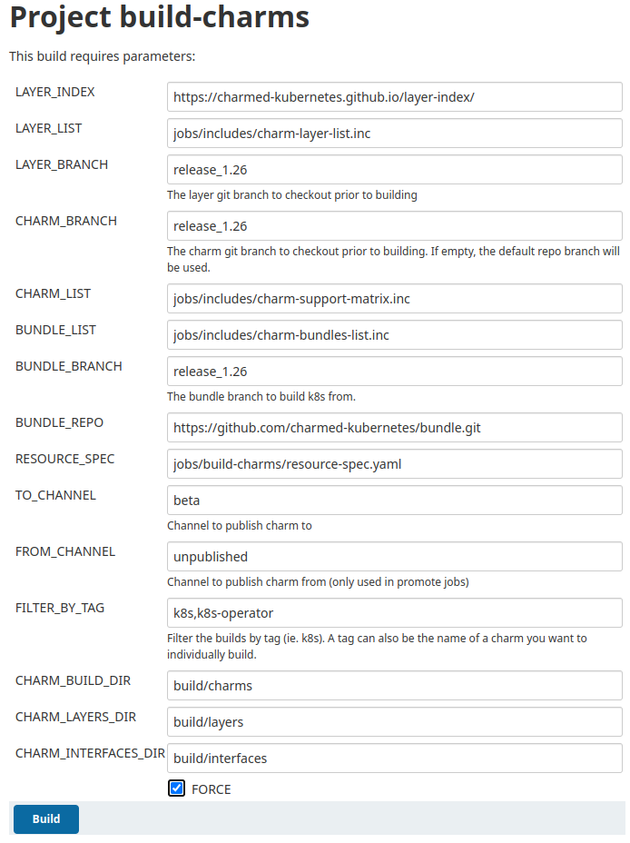
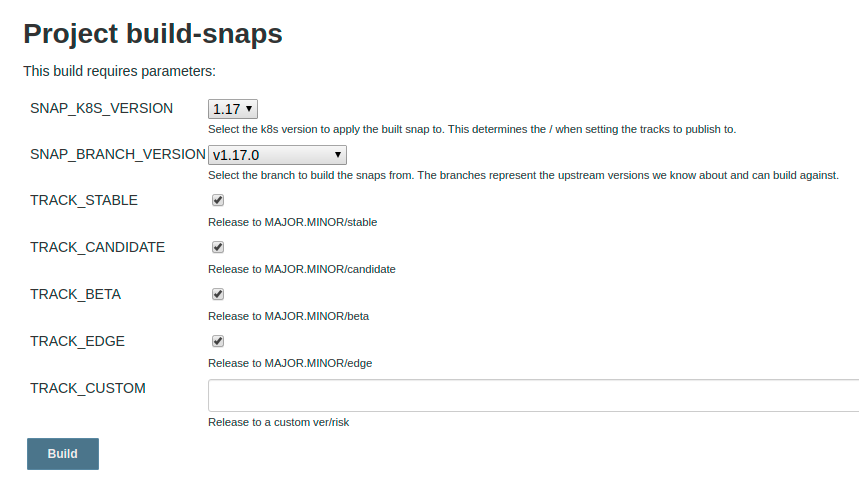

# Creating a stable release
Outlines the processes for publishing a new Charmed Kubernetes release.

## Stable Release Process

### How to read this document

Each step in the release process contains information pertaining to the
description of the jobs and what is required if needing to run the jobs
locally.

Each step should contain the following:

- Job name as seen in jenkins
- Requirements to run the job including what environment variables need to be set
- Example of running the OGC specification within tox.

### Tag existing stable branches with the current stable bundle

For all charm repos that make up CK tag the existing stable branches with
the most recently released stable bundle revision.

**Job**: https://jenkins.canonical.com/k8s/job/sync-stable-tag-bundle-rev/

### Submit PR's to bundle and charms to pin snap version on the stable branches

We need to make sure that the bundle fragments and kubernetes-worker/master/e2e
are set to `<k8sver>/stable` prior to cutting a new release.

> Note: The charms themselves also need to be done as some do not use our
  bundles for deployment.

### Rebase stable on top of master git branches

Once all repositories are tagged we need to rebase what's in master git on
to stable as this will be our snapshot on what we test and subsequently
promote to stable.

**Job**: https://jenkins.canonical.com/k8s/job/cut-stable-release/

### Bump snap version to next minor release

Once the rebase has occurred we need to bump the charms and bundle fragments
to the next k8s minor version, ie 1.17/edge.

### Build new CK Charms from stable git branches

**Job**: https://jenkins.canonical.com/k8s/job/build-charms/

Pull down all layers and checkout their stable branches. From there build
each charm against those local branches. After the charms are built they need to be
promoted to the **beta** channel in the charmstore.

>-
  **Note**: Beta channel is required as any bugfix releases happening at the
  same time will use the candidate channels for staging those releases.

#### Charm build options



### Promote new K8S snaps

Promote new K8S snaps for the upcoming stable release to the beta and
candidate channels of the snapstore.

> **Info**: Please note that currently **CDK-ADDONS** snap needs to be
    manually promoted to the appropriate channels.

**Job**: https://jenkins.canonical.com/k8s/job/build-snaps/

#### Snap build options



### Validate Charmed Kubernetes

With all bits in place, time to validate CK.

**Job**: validate-minor-release

### CNCF Conformance

**Job**: https://jenkins.canonical.com/k8s/job/conformance/

### Notify Solutions QA

Notify solutions-qa that CK is ready to be run through their tests. Once
that is complete and relayed to us, we can start the release to stable.

### Document release notes

- Bugfixes
- Enhancements
- Known Limitations/Issues

### Promote charms from **beta** to **stable**

This job takes a tag, from_channel, and to_channel. The tag defaults to `k8s` so
it will only promote the necessary charms that make up charmed-kuberneetes (the
others are kubeflow related).

_Jenkins Job_: promote-charms

_Requirements_:

**Environment Variables**:

- TOX_WORK_DIR=~/.tox
- FROM_CHANNEL=beta
- TO_CHANNEL=stable
- CHARM_LIST=jobs/includes/charm-support-matrix.inc
- FILTER_BY_TAG=k8s


_Example_:

```
tox -e py36 -- ogc jobs/build-charms/spec.yml -t promote-charms
```

### Promote bundles from **beta** to **stable**

Same as charm promotion.

_Jenkins Job_: promote-bundles

_Requirements_:

**Environment Variables**:

- TOX_WORK_DIR=~/.tox
- FROM_CHANNEL=beta
- TO_CHANNEL=stable
- CHARM_LIST=jobs/includes/charm-support-matrix.inc
- FILTER_BY_TAG=k8s


_Example_:

```
tox -e py36 -- ogc jobs/build-charms/spec.yml -t promote-bundles
```

### Send announcement

Email annoucement to k8s-crew with any relevant information.

### Update ck bundle repo references

Update ck bundle repo to match the current stable snap release and point the
latest to the next minor version.

For example, if 1.16 is the upcoming release, then once CK is released we
need to update the bundle repo stable branch to reflect 1.16/stable. Also,
update the master branch to point to the next K8S release, in this case
1.17/edge.

